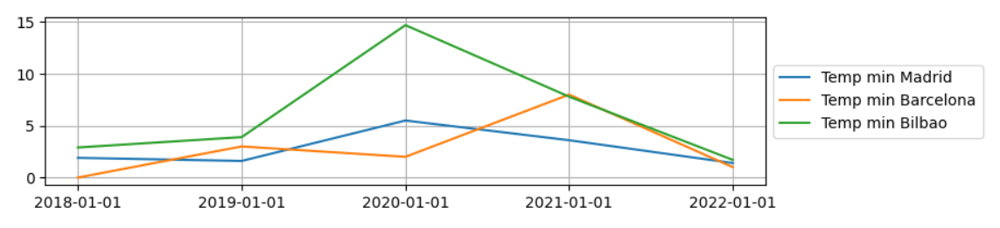

# Project-1: WEATHER DATA ANALYSIS - (Madrid, Barcelona, Bilbao)

**Objective**: The objective of this project is to analyze and visualize the climatic figures (temperature, precipitation, wind speed and atmospheric pressure) of the last 5 years, from 2018 to 2022. At the same time know the current information of these 3 cities.

## Files structure

- **Data:** all csv obtained in the data acquisition process.
- **Images:** images used in this readme.
- **Notebooks:** code used in the data extraction, data manipulation data cleaning, data analysis and data visualization process.
- **Mongo:** database creation and some queries.

## Data extraction cleaning and manipulation
---

The data will be cleaned and manipulated to reveal information about the average temperature of these 3 cities in recent years.

In the jupyter notebook: Extraccion, limpieza y manipulación_csv you will find the following process:

### Data extraction:

Datasets extracted from [Kaggle Data Sets](https://www.kaggle.com/datasets):

- Main dataset: **"city temperature"** 

This dataset includes information about average temperature since 1994 of many Cities.

### Cleaning  
----

- df.dtypes: make sure the columns types are correct
- The dates will be in Stings to facilitate cross-checking of data and information,
- Null values: will replace null values with "0"

### Data manipulation: 
----

- Filter the cities in which we are going to work
- The date we want (in this case years)
- And especially the creation of a new column (fecha) to merge with another database in the future.
- At the end we will get a csv with these columns:
    - Region, Country(str), State(str), City(str), Month(str), Day(str), Year(str), AvgTemperature(float), fecha(str).

##### Data Structure

- Drop the columns that will not be needed: State

## Enrich data through library
----

I will request to geopy library in ordert to get Latitud and Longitud of the cities.

Also I will use meteostat library which provides:  temperatuare av, tempreature min, temperature max, precipitation, wind spd, pressure. I will need the numbers of Lat and Long to get information in meteosat and the dates, in this case we are going to choose the first day of the year (January 1st) of the lasts 5 years.

##### Data Structure

- Drop the columns that will not be needed: wdir, wpgt

## Enrich data through an API
----

- I will request to [Openweather API](https://openweathermap.org/api).
- This api provides current information.
- Everyday the weather change so it has to be updated.

## Load data to Mongo 
----

We export the database to mongo for a better visualization and filter the data that we want to obtain in detail.

# Conclusions
----
As a result we will get the following conclusions (notebook/Conclusions):

*In Madrid the avarage temperature was low in the last 5 years comparing to the others cities*

*The last year the min temperature of the cities were almost the same*

 
 

*Bilbao had a high max temperature when 2020 starts*

 
*Madrid started with high wind speeds compared to other cities, but in the last two years those numbers dropped while in Barcelona and Bilbao rose until they dropped again in 2022.

## Tools used for the project

- [Pandas](https://pandas.pydata.org/)
- [Meteosat](https://dev.meteostat.net/python/)
- [Datetime](https://docs.python.org/3/library/datetime.html)
- [Sys](https://docs.python.org/3/library/sys.html)
- [Matplotlib](https://matplotlib.org/)
- [Requests](https://requests.readthedocs.io/en/master/)
- [Geopy](https://geopy.readthedocs.io/en/stable/)

## Acknowledgements
----

I would like to thank my teachers: Ana, Jean-Charles and Cesar, for giving me help to make this project possible.